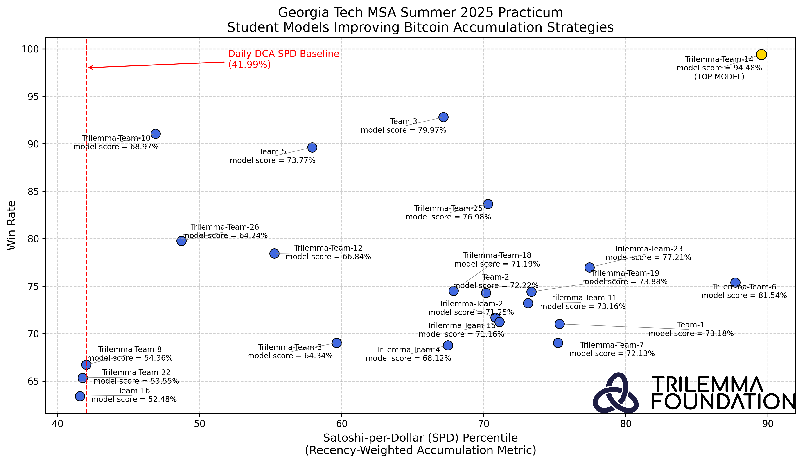

# Improving Bitcoin Accumulation Strategies  
Georgia Tech MSA Summer 2025 Practicum

Welcome to the official practicum repository. This project challenged students to go beyond Dollar Cost Averaging (DCA) and build data driven models for optimizing Bitcoin accumulation.

---

## Overview

[Read more on LinkedIn](https://www.linkedin.com/posts/trilemma-foundation_bitcoin-activity-7355616790770565120-NsMg?utm_source=share&utm_medium=member_desktop&rcm=ACoAADQFpH8BR9a1EzxzZxHP_KzeiQkSrwS56YY)

### Collection of Work

Explore the team repos below: 

1. [GT-MSA-S25-Trilemma-Team-14](https://github.com/TrilemmaFoundation/GT-MSA-S25-Trilemma-Team-14)
2. [GT-MSA-S25-Trilemma-Team-6](https://github.com/TrilemmaFoundation/GT-MSA-S25-Trilemma-Team-6)
3. [GT-MSA-S25-Team-3](https://github.com/TrilemmaFoundation/GT-MSA-S25-Team-3)
4. [GT-MSA-S25-Trilemma-Team-23](https://github.com/TrilemmaFoundation/GT-MSA-S25-Trilemma-Team-23)
5. [GT-MSA-S25-Trilemma-Team-19](https://github.com/TrilemmaFoundation/GT-MSA-S25-Trilemma-Team-19)
6. [GT-MSA-S25-Team-5](https://github.com/TrilemmaFoundation/GT-MSA-S25-Team-5)
7. [GT-MSA-S25-Trilemma-Team-11](https://github.com/TrilemmaFoundation/GT-MSA-S25-Trilemma-Team-11)
8. [GT-MSA-S25-Team-1](https://github.com/TrilemmaFoundation/GT-MSA-S25-Team-1)
9. [GT-MSA-S25-Team-2](https://github.com/TrilemmaFoundation/GT-MSA-S25-Team-2)
10. [GT-MSA-S25-Trilemma-Team-7](https://github.com/TrilemmaFoundation/GT-MSA-S25-Trilemma-Team-7)
11. [GT-MSA-S25-Trilemma-Team-2](https://github.com/TrilemmaFoundation/GT-MSA-S25-Trilemma-Team-2)
12. [GT-MSA-S25-Trilemma-Team-18](https://github.com/TrilemmaFoundation/GT-MSA-S25-Trilemma-Team-18)
13. [GT-MSA-S25-Trilemma-Team-15](https://github.com/TrilemmaFoundation/GT-MSA-S25-Trilemma-Team-15)
14. [GT-MSA-S25-Trilemma-Team-10](https://github.com/TrilemmaFoundation/GT-MSA-S25-Trilemma-Team-10)
15. [GT-MSA-S25-Trilemma-Team-4](https://github.com/TrilemmaFoundation/GT-MSA-S25-Trilemma-Team-4)
16. [GT-MSA-S25-Trilemma-Team-12](https://github.com/TrilemmaFoundation/GT-MSA-S25-Trilemma-Team-12)
17. [GT-MSA-S25-Trilemma-Team-8](https://github.com/TrilemmaFoundation/GT-MSA-S25-Trilemma-Team-8)
18. [GT-MSA-S25-Trilemma-Team-22](https://github.com/TrilemmaFoundation/GT-MSA-S25-Trilemma-Team-22)
19. [GT-MSA-S25-Team-16](https://github.com/TrilemmaFoundation/GT-MSA-S25-Team-16)
20. [GT-MSA-S25-Trilemma-Team-25](https://github.com/TrilemmaFoundation/GT-MSA-S25-Trilemma-Team-25)

---

## 🔍 Why: Problem Statement

The world’s most influential entities—including asset managers, financial institutions, and sovereign wealth funds—are actively accumulating Bitcoin or investigating strategies to do so. This nascent accumulation race underscores a fundamental game-theoretic principle: as others acquire a mathematically scarce asset, the incentive to participate intensifies.

While Dollar-Cost Averaging (DCA) remains a widely utilized approach, it may prove suboptimal amid such competitive dynamics. This project seeks to design data-driven accumulation strategies that retain the key advantages of DCA—namely, consistent and systematic purchases—while enhancing the efficiency of Bitcoin acquisition within a specified budget and time frame. The resulting insights are applicable to retail investors but are particularly valuable for institutions managing high-volume allocations. 

---

## 📦 What: Project Deliverables

### 1. Exploratory Data Analysis (EDA) (Deadline: **June 12**)
- **Purpose**: Identify and evaluate features for smart accumulation strategies.
- **Goal**: Visualize data and extract **non-trivial insights** that could inform model design.
- [**Deliverable**](https://github.com/TrilemmaFoundation/GT-MSA-S25/blob/main/EDA%20Outline.ipynb): A Jupyter notebook showcasing your EDA with compelling visualizations and commentary.

### 2. Final Educational Notebook (Deadline: **July 10**)
- **Purpose**: Explain your strategy to a non-technical audience.
- **Goal**: Visualize and narrate your strategy's logic and results as if teaching a curious layperson.
- [**Deliverable**](https://github.com/TrilemmaFoundation/GT-MSA-S25/blob/main/Final%20Educational%20Notebook%20Outline.ipynb): A comprehensive notebook presenting your model and the EDA that derived it. 

---

## 🚀 How: Project Culture

### Work in Public, Commit in Private
- While this is an **open-source practicum**, we ask each team to push their weekly progress to the **private repository** provided (e.g., `GT-MSA-S25-{team-name}`).
- These repos are private during the challenge and will be made **public** after the model deadline passes.
- If nothing is being pushed, we assume no work is being done.

### Show Initiative
- **Ask questions** in Discord or during weekly office hours.
- We’re here to help—but your **progress determines how much we can support**.
- Share what you're learning, even if it's messy—**insight comes from iteration**.

---

## 🛠️ Getting Started

1. **Send us your GitHub username** so we can invite you to a GitHub Team with access to your private repo (`GT-MSA-S25-{team name}`).
2. Read Chapter 1 & 2 of [Mastering Bitcoin](https://github.com/bitcoinbook/bitcoinbook)
3. **Review the [Problem Statement notebook](https://github.com/TrilemmaFoundation/GT-MSA-S25/blob/main/1.%20Problem%20Statement.ipynb)** to understand the exact objectives of the challenge.
4. **Use the [Data Retrieval notebook](https://github.com/TrilemmaFoundation/GT-MSA-S25/blob/main/2.%20Data%20Retrieval.ipynb)** to fetch and begin exploring the dataset.
5. **Review the [Model Development notebook](https://github.com/TrilemmaFoundation/GT-MSA-S25/blob/main/3.%20Model%20Development%20Template.ipynb)** to use as a reference for structuring and benchmarking your own model.
6. **Check this repository regularly** as we will be updating it with new tutorials, resources, and guidance.

---

## 📣 Final Notes

- Submit all deliverables as Jupyter Notebooks unless otherwise specified.
- All work will be evaluated not only on technical correctness but also **storytelling, clarity, and educational value**.
- The best strategies may be highlighted publicly, so polish your work accordingly.

Let’s build something exceptional 🚀  

---

## 📅 Project Timeline

| Date       | Milestone                    | Description                                      |
|------------|------------------------------|--------------------------------------------------|
| May 12     | Project Launch               | Onboard to Discord |
| May 13     | 1st Office Hour              | General QnA |
| May 20     | 2nd Office Hour              | Onboard to GitHub Repo        |
| May 27     | 3rd Office Hour              | EDA QnA. Onboard to GitHub Repo! Initialize EDA notebook in your repos |
| June 3     | 4th Office Hour              | EDA QnA. EDA deliverable outline + evaluation rubric posted |
| June 10    | 5th Office Hour              | EDA QnA |
| June 12    | **`EDA Notebook Due`**         | Exploratory data analysis that will drive your model. |
| June 17    | 6th Office Hour              | EDA review posted. EDA QnA. Model development QnA. |
| June 24    | 7th Office Hour              | Final deliverable outline + evaluation rubric posted. |
| July 1     | 8th Office Hour              | Reviewing model development template for final deliverable. |
| July 8     | 9th Office Hour              | Model Dev QnA |
| July 10    | **`Final Educational Notebook Due`** | A polished notebook summarizing all your work. |
| July 15    | 10th Office Hour             | Final notebook revisions |
| July 18    | **Public Repo Launch**       | Private repos made public to showcase your work. Final notebook revisions |
| July 22    | Last Office Hour             | Final notebook revisions |
